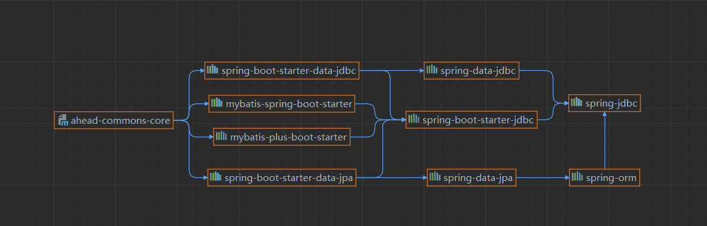

## 框架介绍
该项目基于Spring+JPA+Mybatis(JDBC)提供了基础的应用开发框架。  
数据读取底层基于spring-data-jpa、spring-data-jdbc和Mybtis Plus。支持三种方式读写数据库:
1. 基于Spring的SimpleJpaRepository的数据库读写,建议继承AheadSimpleJpaRepository
2. 基于spring-data-jdbc和Mybtis Plus的数据库读写,建议继承AheadMybatisMapper
3. 自定义封装的fei,该方式基于Hibernate+JPA封装了便于查询的DAO和Service

## 包结构
``` 
  ahead
	|-- context ApplicationContext的静态工具
	|-- dynamicDS 多数据源支持
	|-- entity 数据对象统一接口
	|-- dao 数据读取层统一接口
	|-- service 统一Service接口  
	|-- jpa JPA支持
	    |-- fei Fei支持
	|-- mybatis mybatis支持
```

## 使用说明
该框架中封装了统一实体接口IEntity和统一的服务接口IService，项目中的实体和Service类需要实现统一接口。
#### 使用Spring-data-jpa
maven依赖

```
<dependency>
    <groupId>org.springframework.boot</groupId>
    <artifactId>spring-boot-starter-data-jpa</artifactId>
</dependency>
```
实现步骤

```
1. 定义实体对象(@Table和@Column注解使用javax.persistence包中),实体对象需继承AuditJpaEntity
2. 定义Service,继承AheadJpaServiceImpl
3. 可在application-jpa.yml中配置JPA的相关配置
```
额外说明

```
也可以根据自己需要使用Spring-data-jdbc的SimpleJDBCRepository进行数据库的读写，该方式在框架中未做进一步的封装。  
具体操作在此说明
1. maven配置
    <dependency>
        <groupId>org.springframework.boot</groupId>
        <artifactId>spring-boot-starter-data-jdbc</artifactId>
    </dependency>
2. 使用说明
    1). 定义表结构
    2). 定义实体对象(@Table和@Column、@Id等注解使用spring.data包中)
    3). 定义Service,注入SimpleJDBCRepository
    4). 使用SimpleJDBCRepository操作


```
#### 使用mybatis-plus
```
1. 定义实体对象,实体对象需继承MybatisEntity
2. 定义Mapper,继承AheadMybatisMapper
3. 可在application-mybatis.yml中配置mybatis的相关配置
```
示例:

```
    // 测试JPA
    UserJPAEntity user = new UserJPAEntity();
    user.setName("SPRING-DATA-JPA");
    user.setNickName("JPA");
    user.setAge(30);
    userRepo.save(user);
    // 测试JPA-fei
    user.setName("UDF");
    user.setId(null);
    service.persist(user);
    // 测试mybatis
    UserEntity user2 = new UserEntity();
    user2.setName("mybatis");
    user2.setNickName("mybatis");
    user2.setAge(30);
    mapper.insert(user2);
```
### Spring-data的依赖关系、

、

### 多数据源配置

配置文件:

```
dcube:
  datasource: # 德鲁伊数据源配置
    - key: master
      default: true
      type: com.alibaba.druid.pool.DruidDataSource
      driverClassName: com.mysql.cj.jdbc.Driver
      url: jdbc:mysql://localhost:3306/test?useUnicode=true&characterEncoding=utf8&zeroDateTimeBehavior=convertToNull&useSSL=true&serverTimezone=GMT%2B8
      username: root
      password: cecgw
      # 初始连接数
      initialSize: 5
      # 最小连接池数量
      minIdle: 10
      # 最大连接池数量
      maxActive: 20
      # 配置获取连接等待超时的时间
      maxWait: 60000
      # 配置间隔多久才进行一次检测，检测需要关闭的空闲连接，单位是毫秒
      timeBetweenEvictionRunsMillis: 60000
      # 配置一个连接在池中最小生存的时间，单位是毫秒
      minEvictableIdleTimeMillis: 300000
      # 配置一个连接在池中最大生存的时间，单位是毫秒
      maxEvictableIdleTimeMillis: 900000
      # 配置检测连接是否有效
      validationQuery: SELECT 1 FROM DUAL
      testWhileIdle: true
      testOnBorrow: false
      testOnReturn: false
      webStatFilter:
        enabled: true
      statViewServlet:
        enabled: true
        # 设置白名单，不填则允许所有访问
        allow:
        url-pattern: /druid/*
        # 控制台管理用户名和密码
        login-username:
        login-password:
      filter:
        stat:
          enabled: true
          # 慢SQL记录
          log-slow-sql: true
          slow-sql-millis: 1000
          merge-sql: true
        wall:
          config:
            multi-statement-allow: true
    - key: slave
      type: com.alibaba.druid.pool.DruidDataSource
      driverClassName: com.mysql.cj.jdbc.Driver
      url: jdbc:mysql://localhost:3306/test1?useUnicode=true&characterEncoding=utf8&zeroDateTimeBehavior=convertToNull&useSSL=true&serverTimezone=GMT%2B8
      username: root
      password: cecgw
      # 初始连接数
      initialSize: 5
      # 最小连接池数量
      minIdle: 10
      # 最大连接池数量
      maxActive: 20
      # 配置获取连接等待超时的时间
      maxWait: 60000
      # 配置间隔多久才进行一次检测，检测需要关闭的空闲连接，单位是毫秒
      timeBetweenEvictionRunsMillis: 60000
      # 配置一个连接在池中最小生存的时间，单位是毫秒
      minEvictableIdleTimeMillis: 300000
      # 配置一个连接在池中最大生存的时间，单位是毫秒
      maxEvictableIdleTimeMillis: 900000
      # 配置检测连接是否有效
      validationQuery: SELECT 1 FROM DUAL
      testWhileIdle: true
      testOnBorrow: false
      testOnReturn: false
      webStatFilter:
        enabled: true
      statViewServlet:
        enabled: true
        # 设置白名单，不填则允许所有访问
        allow:
        url-pattern: /druid/*
        # 控制台管理用户名和密码
        login-username:
        login-password:
      filter:
        stat:
          enabled: true
          # 慢SQL记录
          log-slow-sql: true
          slow-sql-millis: 1000
          merge-sql: true
        wall:
          config:
            multi-statement-allow: true
```
程序

```
// 加入DynamicDataSourceRegister依赖和AOP注解
@Import({DynamicDataSourceRegister.class})
@EnableAspectJAutoProxy(exposeProxy = true)
public class ApplicationMain{
	public static void main(String[] args) {
		SpringApplication.run(ApplicationMain.class, args);
	}
}
相关方法中增加@DynamicDS注解
@DynamicDS(name="master")
```

说明

```
因为使用AOP机制对注解进行切面。通过this.xxx()调用当前类方法时注解会失效,所以必须在其他类中引入执行需要AOP的类方法。
https://www.cnblogs.com/duanxz/p/4367362.html
```